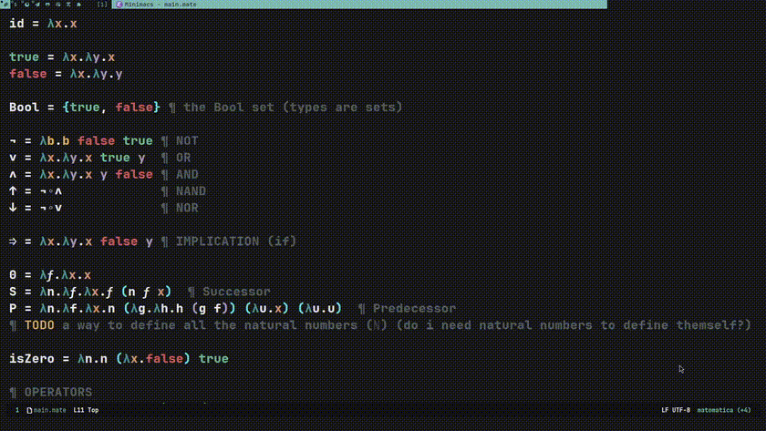

# HELLO WORLD

At its early stage, this language exists solely within Emacs as a mode.
Currently, there are no other programs written in this language,
and a compiler or interpreter has not been implemented yet.

I've chosen this approach to honor the central principle of category theory: abstraction.
By minimizing reliance on machine-specific details,
my goal is to emphasize the language's foundational mathematical principles and essence of computation.

## KEYBINDS
``` emacs-lisp
(define-key matematica-mode-map (kbd "RET") 'smart-return)
(define-key matematica-mode-map (kbd "SPC") 'smart-space)
(define-key matematica-mode-map (kbd "C-j") 'toggle-lambda-definition)
(define-key matematica-mode-map (kbd "C-S-j") 'expand-composition)
(define-key matematica-mode-map (kbd "C-l") 'insert-lambda)
(define-key matematica-mode-map (kbd "C-S-l") 'insert-composition)
(define-key matematica-mode-map (kbd "C-c C-c") 'insert-comment)
(define-key matematica-mode-map (kbd "C-c C-f") 'insert-function-f)
(define-key matematica-mode-map (kbd "C-c C-l") 'insert-arrow)
```

This language mode utilizes the extensive capabilities of Emacs 
offering functions to expand lambda expressions and compositions.
It treats the "=" sign in a mathematically correct manner,
handling it bidirectionally rather than solely as an assignment operator.




# principia.mate
```
id = λx.x

true = λx.λy.x
false = λx.λy.y

Bool = {true, false} ¶ the Bool set (types are sets)

¬ = λb.b false true ¶ NOT
∨ = λx.λy.x true y  ¶ OR
∧ = λx.λy.x y false ¶ AND
↑ = ¬∘∧             ¶ NAND
↓ = ¬∘∨             ¶ NOR

⇒ = λx.λy.x false y ¶ IMPLICATION (if)

0 = λ𝒇.λx.x
S = λn.λ𝒇.λx.𝒇 (n 𝒇 x)  ¶ Successor
P = λn.λf.λx.n (λg.λh.h (g f)) (λu.x) (λu.u)  ¶ Predecessor
¶ TODO a way to define all the natural numbers (ℕ) (do i need natural numbers to define themself?)

isZero = λn.n (λx.false) true

¶ OPERATORS
+ = λm.λn.λ𝒇.λx.m 𝒇 (n 𝒇 x)
* = λm.λn.λ𝒇.λx.m (n 𝒇) x
/ = λm.λn.λf.λx. (isZero n) 0 (n f x)
% = λm.λn.λf.λx. (isZero n) m (sub m (* n (div m n)))
- = λm.λn.n P m

≤ = λm.λn.isZero (sub m n)
< = λm.λn.¬ (λx.λy.x y false) (≤ n m)
> = λm.λn.λx.λy.x y false (≤ m n)
≥ = λm.λn.¬ (λx.λy.x y false) (< m n)


¶ potential syntax
var <- true
var ⇒ print("hello")

¶ this notation probably make no sense
↱ true -> !true -> false -> false
and = λx.λy.x y false
"map true to maybe true then a false to false"


¶ IMPLEMENTATION
¶ IMPORTANT this language need to be lazy as we can define infinite sets
¶ TODO from source code expand every axiom into its pure lambda form then optimize the result using math
¶ TODO is this function a monomorphism ?
¶ TODO memoization
¶ TODO render categories in 3D we could find a function and its opposite in 3D
¶ TODO denote if a set contain itelsf in the type
¶ TODO treat functions as morphisms
¶ ↑ = ¬∘∧ = λx.λy.¬(∧ x y) ¶ TODO support multiple "=" and auto result
¶ ↓ = ¬∘∨ = λx.λy.¬(∨ x y)
¶ morphisms(functions) should respect associativity and identity
¶ compose 2 programs togheter since at the end one program is just
¶ one long function (group of programs)


¶ NOTE
¶ any program written in matematica will be a proof
¶ that what you created is matematically possible
¶ functor = -> Category -> Category

¶ Lists are ordered collections,
¶ meaning the elements are stored in a sequence
¶ that is maintained unless explicitly changed.
¶ Sets, on the other hand, are unordered collections,
¶ so the elements have no particular order and are
¶ stored in a way that allows for efficient lookup and uniqueness.

¶  Lists can contain duplicate elements,
¶  meaning the same value can appear multiple times in the list.
¶  Sets, however, do not allow duplicate elements;
¶  each element in a set is unique.
¶  Sets are mutable, lists are not.


¶ PROPERTIES OF OPERATIONS (and why we should care)

¶ Commutativity: changing the order of operands does not change the result.
¶ Examples:
¶  Addition (a + b = b + a)
¶  Multiplication (a * b = b * a).

¶ Associativity: if the grouping of operands does not change the result.
¶ Examples:
¶  Addition ((a + b) + c = a + (b + c))
¶  Multiplication ((a * b) * c = a * (b * c)).

¶ Distributivity: if combining an element with a sum (or difference) of two other elements produces the same result as combining each term individually with the element.
¶ Example: 
¶  Multiplication distributes over addition (a * (b + c) = (a * b) + (a * c)).

¶ Why we should care:
¶ We encode operations as functions, and to avoid having our language look like this: *(1,2) 
¶ or like Lisp: (* 1 2), we should infer properties for every function we define automatically.
¶ This makes writing expressions like 1 * 2 possible, intuitive, mathematically correct and provable.


¶ EXTRA properties
¶ Idempotence: An operation is idempotent if applying it multiple times to a value yields the same result as applying it once.
¶ Example: Boolean OR (a ∨ a = a).

¶ Closure: An operation is closed if applying it to elements within a certain set always produces a result that is also within that set.
¶ Example: Addition of integers is closed under integers.

¶ Totality: An operation is total if it is defined for all possible input values.
¶ Example: Division is not total for all integers (division by zero is undefined).


¶ FUNNY WORDS 
¶ y combinator
¶ isomorphism (are they the same?)
¶ abstraction (subtraction from greek)
¶ bijection
¶ morphisms(arrows or functions) should respect associativity and identity
¶ functor = -> Category -> Category
¶ grupoids
¶ fiber
```
